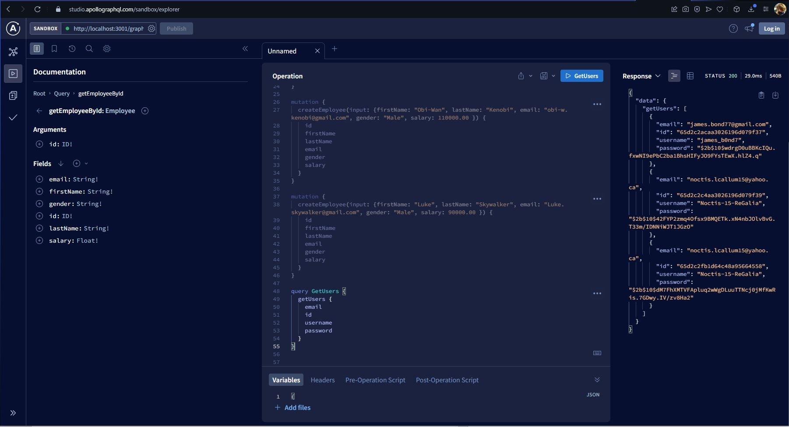
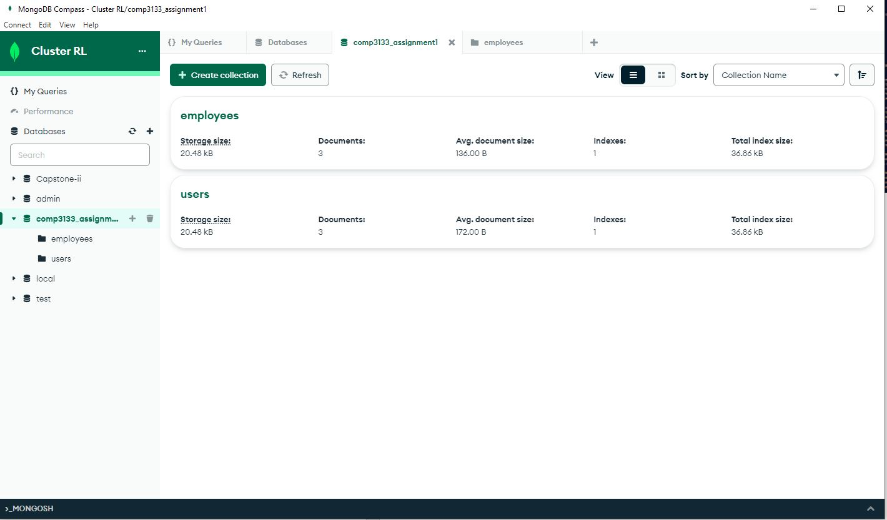
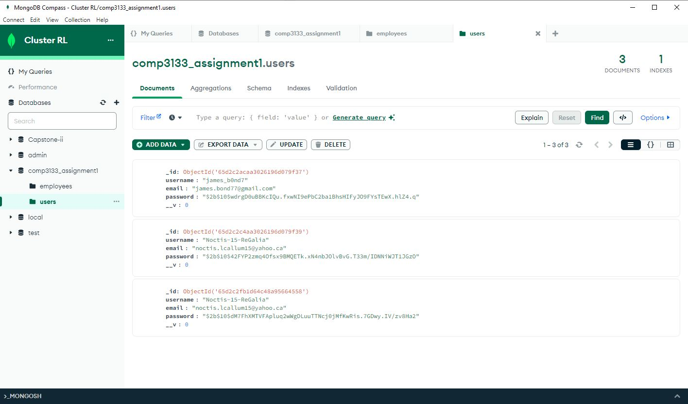

# Full Stack Development - Assignment 1
Create a Backend application using Node JS, GraphQL, MongoDB, and Express

## Deliverables
Create GraphQL API's that is able to accept JSON data as objects for the following

| Sr. # | Method | Operations | Description |
| :---: | ------ | -----------| ----------- |
| 1 | Mutation | SignUp | Allow user to create a new account |
| 2 | Query | Login | Allow user to access the system |
| 3 | Query | Get all employees | User can get all employees |
| 4 | Mutation | Add new employee | User can create a new employee |
| 5 | Query | Search employee by id | User can get employee details by employee id | 
| 6 | Mutation | Update employee by id | User can update employee details |
| 7 | Mutation | Deletet emplyee by id | User can delete employee by employee id |

MongoDB database should be named comp3133_assignment1 with these collections:

 

**User Collection**

| Field Name | Type | Constraint |
| ---------- | ---- | ---------- |
| _id        | Object ID | Auto Generated |
| username   | String | Primary Key |
| email      | String | Unique |
| password   | String | May be encrypted with other fields |

User can login using username/email and password
 

**Employee Collection**

| Field Name | Type | Contraint |
| _id | Object ID| Auto Generated (not needed to be added into the modedls) |
| first_name | String | Required |
| last_name | String | Required |
| email | String | Unique |
| gender | String | Male/Female/Other |
| salary | Float | Required |

 

**Notes**

- Implement GraphQL API usingg Apollo server
- Test GraphQL API using GraphiQL or Postman
- Validate the imput data whenever required
- Return error details or success response details whenever required
- Optionally apply JWT security concept to secure all your API calls

## Developer Notes
**2024/02/19** 

Hello Ryan here! This was my first time working with GraphQL and it was alot to learn. Will definantly revisit this project and make imporvments for learning/ experience purposes. 

Unfortunatly I wasn't able to implement the signup and login features, but I was able to implement all GraphQL API calls and store them into my mongoDB database! Here is an example of my generating a User & having their password censored for security purposes
 

**Create User**

 

**Display All Users**

 

I was also able to connect my mongoDb cluster and create models/schemas for the respective JSON data to be transfered into collections.

